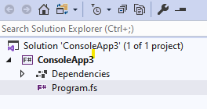
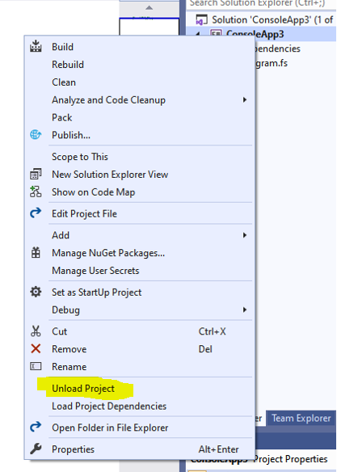
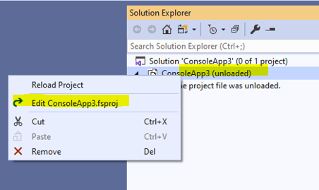
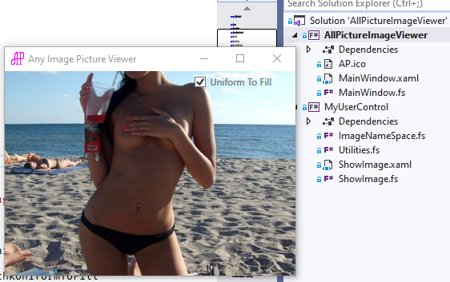
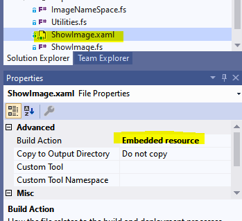

## All Picture Image Viewer

#### This is example how to create WPF application with F\# (F sharp) only with Dot Net Core 3.1

#### Create F\# Core 3.1 Console App (.Net Core) , give project name and "Create".

#### Right click on project and "Unload Project"

#### And Edit project file itselfs.

#### And replace

\<Project Sdk=\"Microsoft.NET.Sdk\"\>

\<PropertyGroup\>

\<OutputType\>Exe\</OutputType\>

\<TargetFramework\>netcoreapp3.1\</TargetFramework\>

\</PropertyGroup\>

....

#### To this

\<Project Sdk=\"Microsoft.NET.Sdk.WindowsDesktop\"\>

\<PropertyGroup\>

\<OutputType\>WinExe\</OutputType\>

\<TargetFramework\>netcoreapp3.1\</TargetFramework\>

\<UseWPF\>true\</UseWPF\>

\</PropertyGroup\>

....

#### Save and reload project. Mostly done.
#### You can use this application like template or full working example for viewing any type of image.

#### For create subproject use absolutely same rule. Add subproject like dependent project.

#### Pay your attention about class Utilities (file Utilities.fs) it includes everything for download XAML file from assembly and convert it to content, find user control, etc.

#### All XAML files must be "Embedded resource"

#### For converting word doc to readme.md file I used  <https://pandoc.org/MANUAL.html>
